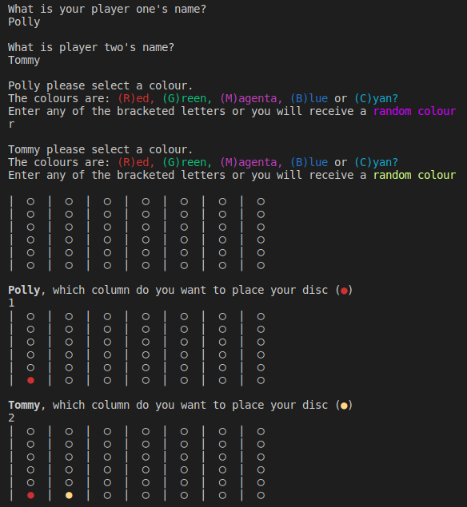
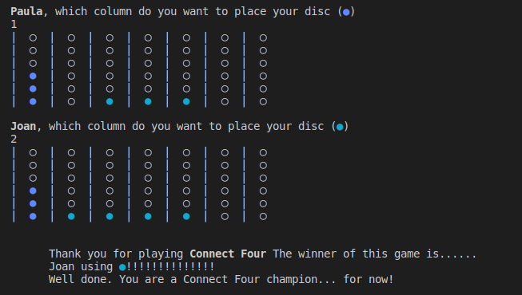
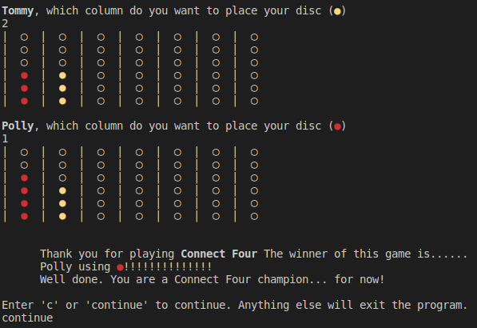
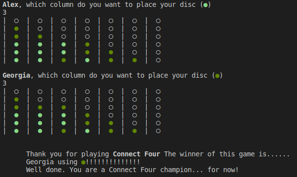

# Connect Four (using Test Driven Development)
This program was mostly about employing **Test Driven Development** (TDD) using Rspec. TDD, in short, requires you to make tests before making any methods/functions that would pass that test. After writing code that would result in passing these tests, you can then refactor (redesign) your code with little issue. [Here](https://www.madetech.com/blog/9-benefits-of-test-driven-development) is more information. See the bottom for my final thoughts and some screen captures.

## Aim
So, the main aim revolved around writing tests beforehand, write passing code and then re-write said code to read nicely and contain small, specific and simple methods.
In addition to that, I resolved to improve my overall design (the refactor stage). I previously had more complicated and long (but not egregiously so) methods; the design of some methods made hypothetical testing difficult as they were unnecessarily calling other methods in the program. While my general separation of tasks into modules and classes was fine, these issues persisted within modules and classes. Hence, I was determined to *start* improving upon that now.

## Tasks
- [x] Use TDD to make a Connect Four game
  - [x] (Optional) Use A-A-A (Arrange-Act-Assert) as far as possible
  - [x] (Optional) Use a variety of actions/matchers (e.g. stubbing, spies, annonymous classes etc)
  - [x] (Optional) Refactor methods
- [x] Have the game recognise both diagonals
- [x] (Optional) Improve upon past design flaws
- [x] (Optional) Make a somewhat appealing display
  - [x] (Optional) Use unicode symbols and terminal colours

## Resources
Some resources that I used when making this program:
- Terminal Formatting and Colour
  - https://misc.flogisoft.com/bash/tip_colors_and_formatting
- Understanding and reducing Assignment-Branch-Condition complexity of methods
  - https://stackoverflow.com/questions/55422300/assignment-branch-condition-size-is-too-high
- Stubs, Mocks and Spies
  - http://testing-for-beginners.rubymonstas.org/test_doubles.html
- Anonymous classes for module testing
  - https://stackoverflow.com/questions/1542945/testing-modules-in-rspec
- Markdown formatting
  - https://docs.github.com/en/github/writing-on-github
  - Local images https://stackoverflow.com/questions/41604263/how-do-i-display-local-image-in-markdown
- Screenshot (section)
  - https://askubuntu.com/questions/1183877/how-to-take-a-screenshot-of-a-section-of-the-screen-on-xubuntu-18-04

## Final thoughts
I found this to be a nice introduction to TDD and good motivation on writing concise and simple methods. Naturally, there was a fair bit to learn about Rspec, not all of which were used, but it was interesting enough and, at the very least, a confidence improving.

## Examples
Really just me attempting to use tables and insert images, but also give *some* useful information about the game.

| Game intro | Row winner |
| ---------- | ---------- |
| | 

| Column winner | Diagonal winner |
| ------------- | --------------- |
|  | 

Let me know if you have any suggestions.